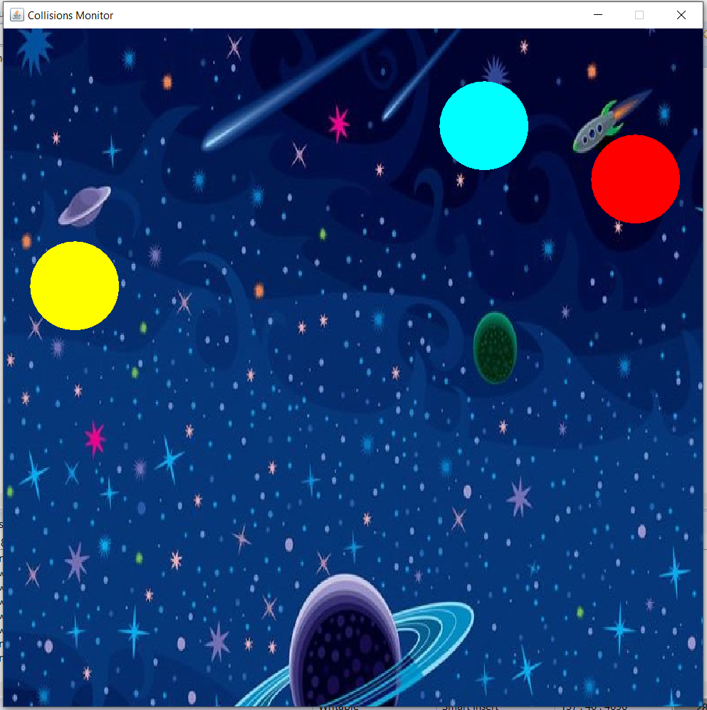
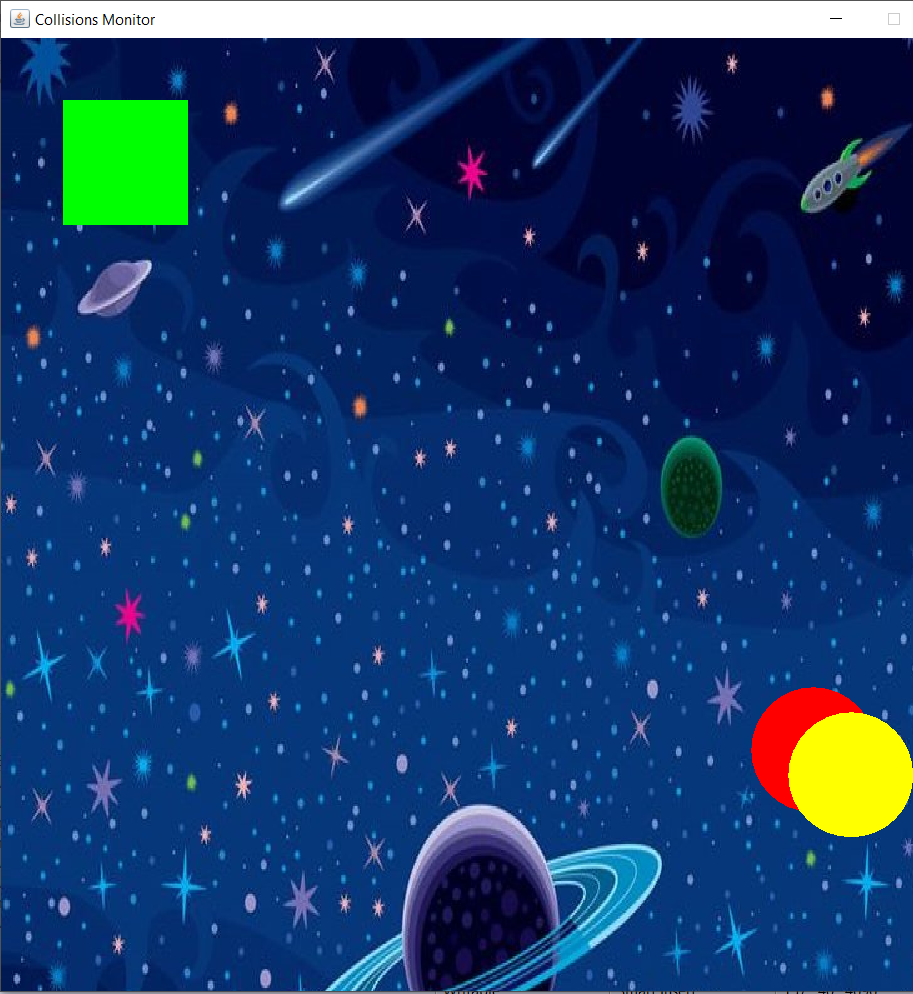

# Physics-Collisions
This is a simple program that applies Newton's third law with the frame edges and to detect collisions between objects using three objects .  The fourth object i used it for the other function of the program which is the collisions detection only

